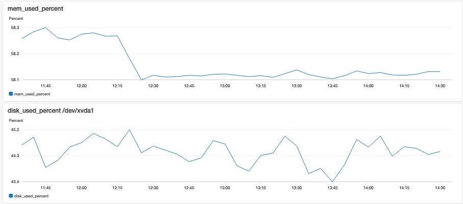

# cloudwatch-agent

## What's this ? 
- CloudWatch Agent をインストールする Ansible Role
    - Ubuntu 18.04 で成功例あり


## PreRequirements
- Ansible 実行クライアント
    - Ansible setup
    - 設定ファイルの準備
        - ansible.cfg (see example)
        - inventory   (if necessary)

- 対象のサーバー
    - Ubuntu 18.04 
    - SSH接続できること    
    - IAM Role を適切に割り当てておく
        - refs https://docs.aws.amazon.com/ja_jp/AmazonCloudWatch/latest/monitoring/create-iam-roles-for-cloudwatch-agent.html
    

## Usage
- Get and Set properly `cloudwatch-agent` role
    - ex) 
        ```
        git clone https://github.com/sogaoh/AnsiblePractice.git
        cd AnsiblePractice/aws-CloudWatch/roles
        mv cloudwatch-agent ${your_properly_roles_directory}/
        cd ${your_properly_execute_directory}
        # configure your ansible.cfg, inventory file, 
        ```

- Prepare playbook (Sample is below:)
  ```
  - hosts: all
    become: yes
  
    vars:
      ansible_python_interpreter: /usr/bin/python3
  
    roles:
      - cloudwatch-agent
  ```

- Run playbook
  - ex) ansible-playbook ./target-host.yaml -i "[target host IP, etc...]," -vv -C


## Note
- SSM にパラメータを保存しないので AWS のクレデンシャルは不要のはず
- プロセス監視の設定も投入できると思う
    - refs https://dev.classmethod.jp/articles/cloudwatchagent-process-monitor-action/


## Assumed Result

