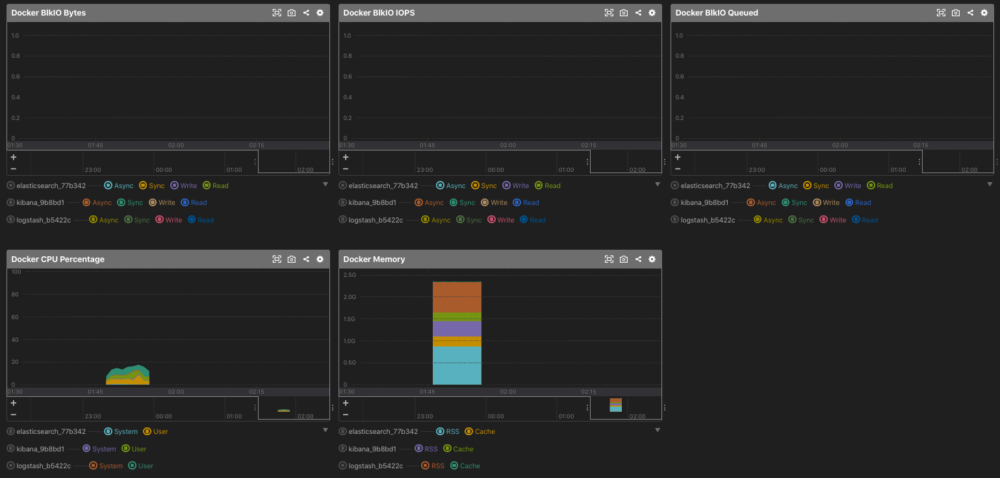

# mackerel-agent-plugins_docker
a Ansible Role

## What's this ?
- mackerel-plugin-docker を利用したメトリクス採取をしようとして
  でも簡素にセットアップやりたくて作成した Ansible Role .

## Pre-Requirement
- 対象の docker サーバー
    - mackerel-agent-plugins のインストール

## Usage
- Get and Set `mackerel-agent-plugins_docker`
    - ex) 
        ```
        git clone https://github.com/sogaoh/AnsiblePractice.git
        cd AnsiblePractice/roles
        mv mackerel-agent-plugins_docker ${your_properly_roles_directory}/
        cd ../..
        rm -rf AnsiblePractice
        ```
- Prepare playbook (Sample is below:)
    ```
    - hosts: all
      become: yes

      roles:
        - mackerel-agent-plugins_docker
    ```
- Run playbook
    - ex) `ansible-playbook ./docker-host.yaml -i "[target host IP, etc...]," -vv -C`

## Assumed Result

