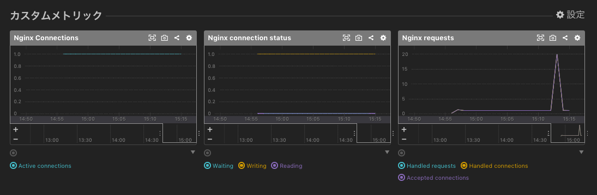

# mackerel-agent-plugins_nginx
a Ansible Role

## What's this ?
- mackerel-plugin-nginx を利用したメトリクス採取をしようとして
  でも簡素にセットアップやりたくて即席で作成した Ansible Role .
    - refs: [Nginxの監視 ~ mackerel-plugin-nginxを読み解く (Mackerel プラグインアドベントカレンダー(全部CRE）2017 # Day 3)](https://soudai.hatenablog.com/entry/mackerel-plugin-nginx)

## Prerequirement
- 対象の nginx サーバー
    - nginx_status のセットアップ
        - nginx_status用confファイルの配置
        - nginx_status取得用ポートの解放
        - nginxのrestart
    - mackerel-agent-plugins のインストール
        - RHEL系OSであれば、 `yum install mackerel-agent-plugins` でok だと思う

## Usage
- Get and Set `mackerel-agent-plugins_nginx`
    - ex) 
        ```
        git clone https://github.com/sogaoh/AnsiblePractice.git
        cd AnsiblePractice/mackerel-fundamental/roles
        mv mackerel-agent-plugins_nginx ${your_properly_roles_directory}/
        cd ../../..
        rm -rf AnsiblePractice
        ```
- Prepare playbook (Sample is below:)
    ```
    - hosts: all
      become: yes

      roles:
        - mackerel-agent-plugins_nginx
    ```
- Run playbook
    - ex) `ansible-playbook ./pera-web.yaml -i "[target host IP, etc...]," -vv -C`

## Assumed Result


