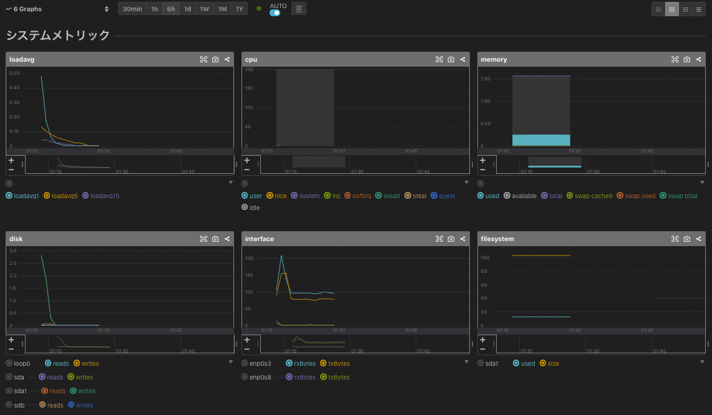
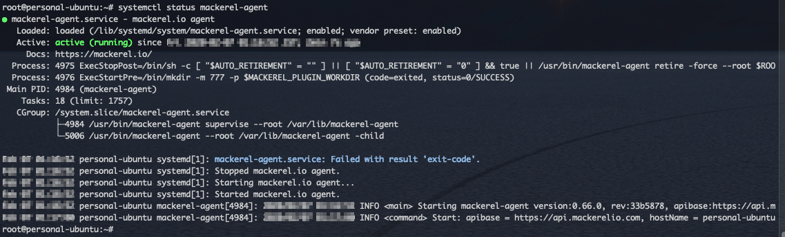

# mackerel-agent

## What's this ?
- mackerel-agent をインストールする Ansible Playbook .

## PreRequirement
- Sign up https://mackerel.io/
    - confirm API key

- Ansible 実行クライアント
    - Ansible setup
    - 設定ファイルの準備
        - ansible.cfg (see example)
        - inventory   (if necessary)
    - ansible-galaxy から `mackerelio.mackerel-agent` Role の取得
        ```
        ansible-galaxy install mackerelio.mackerel-agent
        cd ${your_properly_roles_directory}
        mv ${/path/to/.ansible}/roles/* ./ 
        cd -
        ```

- 対象のサーバー
    - SSH接続できること


## Usage
- Get and Set properly `mackerel-agent` playbook
    - ex) 
        ```
        git clone https://github.com/sogaoh/AnsiblePractice.git
        cd AnsiblePractice/playbooks/mackerel-agent
        cp -p mackerel-agent_setup.yaml ${your_properly_execute_directory}/
        cd ${your_properly_execute_directory}
        # configure your ansible.cfg, inventory file, 
        ```

- Check playbook content
    - Ubuntu (18.04) 用に書いてありますが、CentOS (7) がターゲットの場合など適宜書き換えてください

- Run playbook
    - ex) `ansible-playbook ./mackerel-agent_setup.yaml -i "192.168.33.30," -e mackerel_agent_apikey={YOUR_API_KEY} -u vagrant --private-key=~/.ssh/personal-ubuntu.key -v -C`

## Assumed Result
- add Host
    

- metrics
    

- status
    

