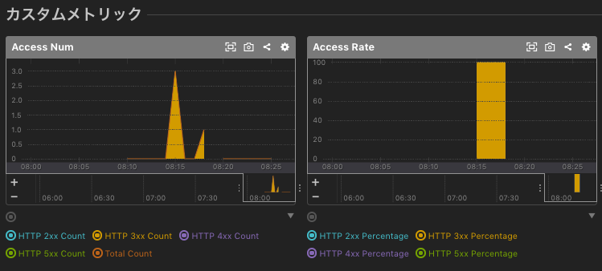

# mackerel-agent-plugins_accesslog
a Ansible Role

## What's this ?
- mackerel-plugin-accesslog を利用したメトリクス採取をしようとして
  でも簡素にセットアップやりたくて即席で作成した Ansible Role .
    - refs: 
        - [mackerel-plugin-accesslog徹底解説)](https://mackerel.io/ja/blog/entry/advent-calendar2017/day9-mackerel-plugin-accesslog)
        - [Webサーバーアクセスログの分析と監視 〜 mackerel-plugin-accesslog を読み解く (Mackerel アドベントカレンダー（全部CRE）2018 # Day 13)](https://blog.a-know.me/entry/2018/12/13/094823)
        - https://github.com/mackerelio/mackerel-agent-plugins/blob/master/mackerel-plugin-accesslog/README.md

## Prerequirement
- 対象の nginx/apache サーバー
    - mackerel-agent-accesslog のインストール
        - RHEL系OSであれば、 `yum install mackerel-agent-plugins` でok だと思う

## Usage
- Get and Set `mackerel-agent-plugins_accesslog`
    - ex) 
        ```
        git clone https://github.com/sogaoh/AnsiblePractice.git
        cd AnsiblePractice/roles
        mv mackerel-agent-plugins_accesslog ${your_properly_roles_directory}/
        cd ../..
        rm -rf AnsiblePractice
        ```
- Prepare playbook (Sample is below:)
    ```
    - hosts: all
      become: yes

      roles:
        - mackerel-agent-plugins_accesslog
    ```
- Run playbook
    - ex) `ansible-playbook ./pera-web.yaml -i "[target host IP, etc...]," -vv -C`

## Assumed Result
  
（LTSV形式のアクセスログではないのでLatencyは出ない）

